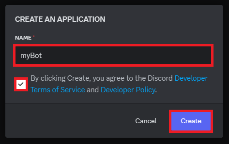

# Step 01 - Making Your First Bot with Discord.Net

Dies ist eine Schritt-für-Schritt Anleitung um einen eigenen Discord Bot mit C# zu bauen. **Wichtiger Hinweis:** Es werden nur die Grundlagen erklärt um einen funktionierenden Bot zu bauen.

---

### Schritt 01
Besuche das [Discord Dev Portal](https://discord.com/developers/applications/).

---

### Schritt 02
Klicke oben rechts auf **"New Application"** und gib deinem Bot einen Namen.

---

### Schritt 03
Nachdem du den Bot erstellt hast, benötigen wir den **OAuth2 Link**, um unseren Bot zu einem Discord Server hinzuzufügen. 

Folgende Socpes und Permissions müssen angegeben werden:

**Scopes:**
- bot *
- application.commands

**Bot Permissions:**
- Administrator

---

### Schritt 04
Nimm den generierten Link und gehe zu **General Information**. In den allgemeinen Einstellungen füge den Link in die Beschreibung ein, falls du den Bot jemals wieder auf deinem Server einfügen möchtest.

**Optional:** Wenn der Bot noch nicht auf Öffentlich gesetzt ist, setzen Sie ihn auf Öffentlich.

---

### Schritt 05
Nun müssen wir noch wichtige Einstellungen für den Bot vornehmen, damit wir uns über die C# Solution mit dem Bot verbinden können. Dazu benötigen wir einen **Token**. 

**Hinweis:** Möglicherweise muss der Token noch mit einem 2-Faktor-Reset zurückgesetzt werden.

Gehe auf **Bot** und setze den Token zurück. Zur Sicherheit kannst du den neuen Token im **Editor** oder **Notepad++** speichern.

Scrolle nun ein wenig nach unten und aktiviere **"Message Content Intent"**.

---

### Schritt 06
Der Bot ist nun einsatzbereit und wir können mit unserer Solution beginnen. 

-> [Zum Nächsten Kapitel 02 - Aufbau der Solution & Die erste Verbindung](/Guide/Step02/README.md)

-> [Zurück zur Startseite](/README.md)