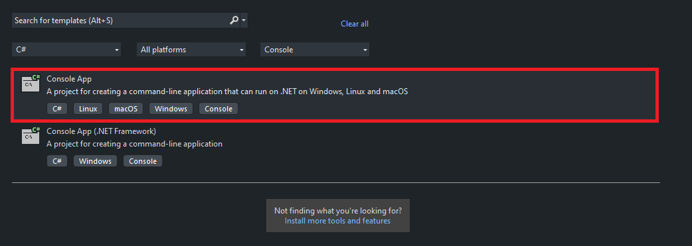
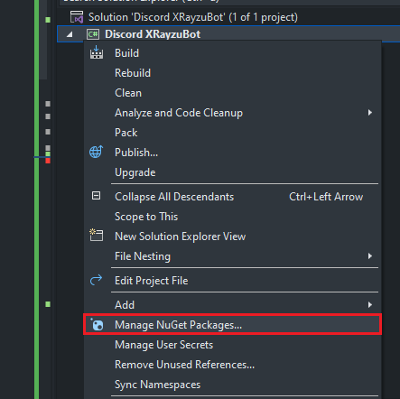
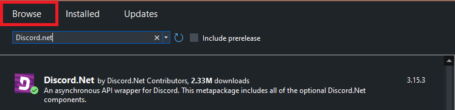
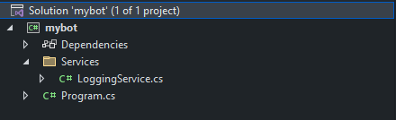
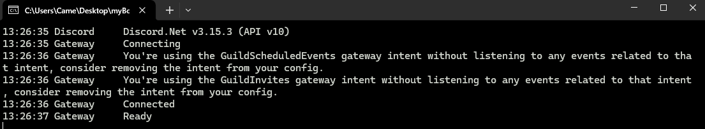

# Step 02 - Making Your First Bot Solution

Dies ist eine Schritt-für-Schritt Anleitung um einen eigenen Discord Bot mit C# zu bauen. **Wichtiger Hinweis:** Es werden nur die Grundlagen erklärt um einen funktionierenden Bot zu bauen.

---

### Schritt 01
Gehe zu Visual Studio und erstelle eine **"Console App"**.
**Wichtig:** Um diese Lösung zu erstellen benötigt man min. **.NET 5.0**
Erstelle nun die Solution.



---

### Schritt 02
Klicken Sie mit der rechten Maustaste auf die Lösung und suchen Sie nach **"Manage NuGet Packages..."**.



Dann klicke auf Browse und suche nach Discord.net.



Anschliessend Discord.net installieren.

---

### Schritt 03 - Die erste Connection
Das Discord.net Paket bietet uns viele neue Dinge, die wir nutzen können. Für weitere Informationen [**Klick hier**](https://docs.discordnet.dev/api/index.html).

Auf der **Program.cs** werden folgende **Usings** benötigt:
```C#
using Discord;
using Discord.WebSocket;

namespace myBot 
{
    public class Program
    {
        public static Main() {
            Console.WriteLine("Hello World!");
        }
    }
}
```

Um eine Verbindung zum Discord Bot herzustellen, benötigen wir einen Client.
Der ``DiscordSocketCLient`` hilft uns dabei. Wir müssen nun auch unseren Main Asynchron bauen. 

**Hinweis:** Der Discord Client arbeitet mit **Type Task** deswegen werden auch die nachkommenden **Methods** als Task angegeben.

```C#
public class Program 
{

    private static DiscordSocketClient _client;

    public static async Task Main() {
        _client = new DiscordSocketClient();
    }

}
```

Wir müssen nun dem **Client** seinen **Token** geben, sodass er schlussendlich seine Verbindung aufbauen kann und wir mit unseren Benutzern Kommuniziern können.

Um eine Verbindung auf zubauen benutzen wir die ``LoginAsync(Tokentype, Token)`` Method von unserem **Client**, da wir einen Bot bauen benutzen wir den ``Tokentype.Bot``. 


Danach können wir mit ``StartAsync()`` den Service starten.

```C#
public class Program 
{

    private static DiscordSocketClient _client;
    private static string _token = "Token";

    public static async Task Main() {

        _client = new DiscordSocketClient();

        await _client.LoginAsync(TokenType.Bot, _token);
        await _client.StartAsync();

    }

}
```

Wenn ihr nun das Program startet werdet ihr merken das der die Connection aufgebaut wird und direkt geschlossen wir. Mit ``Task.Delay(-1)`` können wir verhindern dass die Connection wieder geschlossen wird.

Dir wird wahrscheinlich aufgefallen sein, dass du keinen Unterschied siehst in der Console, dagegen sehen wir auf Discord, dass der Bot Online erscheint.

```C#
public class Program 
{

    private static DiscordSocketClient _client;
    private static string _token = "Token";

    public static async Task Main() {

        _client = new DiscordSocketClient();

        await _client.LoginAsync(TokenType.Bot, _token);
        await _client.StartAsync();

        await Task.Delay(-1); // Runs Forever

    }

}
```

Um nun auch auf der **Console** zu sehen was der Bot genau gemacht oder ob Fehlermeldungen erscheinen benutzen wir eine Einfache Version den Loggens. Später schauen wir im [LoggingService Kaptiel](https://docs.discordnet.dev/guides/concepts/logging.html) an wie wir einen genauern logger bauen.

Ich empfehle dir schonmal eine Klasse dafür zu bauen sodass dein **Program.cs** nicht all zu gross wird.

```C#
public class Program 
{

    private static DiscordSocketClient _client;
    private static string _token = "Token";

    public static async Task Main() {

        _client = new DiscordSocketClient();
        _client.Log += LoggingService.Log;

        await _client.LoginAsync(TokenType.Bot, _token);
        await _client.StartAsync();

    }

}

public class LogginService 
{
    public static Task Log(LogMessage msg)
    {
        Console.WriteLine(msg.ToString());
        return Task.CompletedTask;
    }
}
```

Optional wäre es wenn du eine Ordner **"Services"** machst um später weitere Dienstedort einzubauen. Eine strukturierte Solution, eine gute Solution.



Wenn du nun die Solution startest wirst du in der **Console** sehen dass es verschiedene Logs macht welche schlussendlich dir zeigen ob der Bot verbunden und start klar ist.



---

Der **Bot** läuft nun so wie wir es wollen. Im nächsten Kapitel schauen wir uns an wie wir einen SlashCommand einbauen.

-> [Zum Nächsten Kapitel 03 - SlashCommand einbauen](/Guide/Step03/README.md)

-> [Zur Startseite](/README.md)