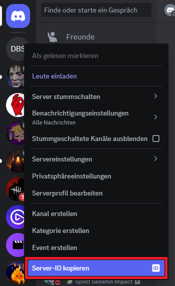
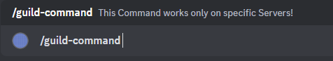
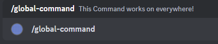
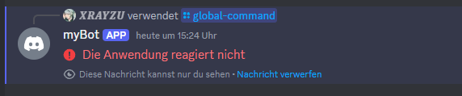

# Step 03 - Making Your First SlashCommand

Dies ist eine Schritt-für-Schritt Anleitung um einen eigenen Discord Bot mit C# zu bauen. **Wichtiger Hinweis:** Es werden nur die Grundlagen erklärt um einen funktionierenden Bot zu bauen.

---

### Schritt 01

**Wichitg:** Falls du dem **Bot** auf den Discord Dev Einstellungen > OAuth2 nicht ``applications.commands`` aktiviert hast tue dies jetzt, da wir sonst keinen zugriff haben um Commands auszuführen.

**Sicherheitshalber:** Bevor wir nun den ersten Command bauen, müssen wir dem **Client** noch einen **Cache** einbauen. Wir bauen nun eine Methode welche die Nachrichten **Nimmt** oder **Runterlädt** und **Cached**.

```C#
public class Program 
{

    private static DiscordSocketClient _client;
    private static string _token = "Token";

    public static async Task Main() {

        _client = new DiscordSocketClient();
        _client.Log += LoggingService.Log;

        await _client.LoginAsync(TokenType.Bot, _token);
        await _client.StartAsync();

        _client.MessageUpdated += MessageUpdated;

    }

    private static async Task MessageUpdated(Cacheable<IMessage, ulong> before, SocketMessage after, ISocketMessageChannel channel)
    {
        // Wenn sich die Nachricht nicht im Cache befand, wird beim Herunterladen eine Kopie von `after` erstellt.
        var message = await before.GetOrDownloadAsync();
        Console.WriteLine($"{message} -> {after}");
    }

}
```

---

### Schritt 02
Um ein Command auszuführen, müssen die zuerst erstellen und bauen dafür in einer seperaten Klasse eine Methode welche beim Ready zuerst mal all unsere Commands initalisiert.

Mit ``var guildCommand = new SlashCommandBuilder();`` erstllt man seinen Command. Ein Command besteht Grundsätzlich aus dem Name ``.WithName()`` und der Beschreibung ``.WithDescription()``.

Mit ``_client.Ready += method();`` können wir beim Start diese Methode initalisieren.

```C#
public class Program 
{

    private static DiscordSocketClient _client;
    private static string _token = "Token";

    public static async Task Main() {

        _client = new DiscordSocketClient();
        _client.Log += LoggingService.Log;

        await _client.LoginAsync(TokenType.Bot, _token);
        await _client.StartAsync();

        _client.MessageUpdated += MessageUpdated;
        _client.Ready += InitCommands;

    }

    private static async Task InitCommands() {

        var ServerID = _client.GetGuild(guildId);

        // Command Only for specific Server
        var guildCommand = new SlashCommandBuilder()
            .WithName("guild-command")
            .WithDescription("This Command works only on specific Servers!");

        // Command for every Server & User | Global
        var globalCommand = new SlashCommandBuilder()
            .WithName("global-command")
            .WithDescription("This Command works on everywhere!");

        try
    {
        // Um Server spezifische Commands zu Initalisiern
        await ServerID.CreateApplicationCommandAsync(guildCommand.Build());

        // Um jeden Commands zu Initalisiern
        await _client.CreateGlobalApplicationCommandAsync(globalCommand.Build());
        
    }
    catch(ApplicationCommandException exception)
    {
        var json = JsonConvert.SerializeObject(exception.Errors, Formatting.Indented);

        Console.WriteLine(json);
    }

    }

}
```

``guildId`` Diese ID müsste man von einem der Server entnehmen um diese zu testen. Die Server ID brauchen wir nur wenn wir Commands bauen möchten die nur bestimmte Server benutzen könne.



Wenn du nun deine Solution startest wirst du sehen dass du mit ``/global-command`` oder in bestimmten Server  ``/global-command`` und ``/guild-command`` benutzen kannst.




Du kannst versuchen Sie auszuführen aber schlussendlich werden sie nicht reagiern, da wir noch keine Antwort darauf gebaut haben.



---

Im nächsten Kapitel schauen wir uns die verschiedenen Responses an und wie wir auf verschiedene Commands richtig antworten können.

-> [Zum nächsten Kapitel 04 - Auf SlashCommands antworten](/Guide/Step04/README.md)

-> [Zur Startseite](/README.md)