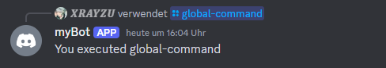
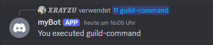
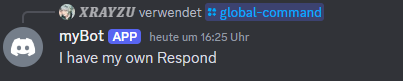

# Step 04 - Making Your First SlashCommandResponse

Dies ist eine Schritt-für-Schritt Anleitung um einen eigenen Discord Bot mit C# zu bauen. **Wichtiger Hinweis:** Es werden nur die Grundlagen erklärt um einen funktionierenden Bot zu bauen.

---

### Schritt 01
Wir haben nun einen Command im vorherigen Kapitel gebaut und dieser hat uns keine Antwort gegeben.


Jetzt werden wir einen **CommandController** bauen, welcher unseren **Command** annimmt und etwas zurück Spuckt zugleich zeige ich euch noch welche **"Respond"** Arten es gibt. Darauf werden wir unseren Controller so erweitern sodass wir verschiedene Commands annehemen können und andere Antworten geben können.

Fangen wir an eine neue Klasse zu bauen welche sich dann im neuen Ordner Modules einpflatzt.

```C#
using Discord;
using Discord.Websocket;

public class Program
{
    private static DiscordSocketClient _client;
    private static string _token = "Token";
    public static async Task Main()
    {
        _client = new DiscordSocketClient(); // init Client
        _client.Log += LoggingService.Log;

        await _client.LoginAsync(TokenType.Bot, _token); // Create Connection
        await _client.StartAsync(); // Start ConnectionService

        _client.Ready += InitCommands;

        _client.SlashCommandExecuted += SlashCommandContoller.SlashCommandHandler;

        await Task.Delay(-1); // Runs Forever
    }
}

public class SlashCommandContoller
{
    public static async Task SlashCommandHandler(SocketSlashCommand command)
    {
        await command.RespondAsync($"You executed {command.Data.Name}");
    }
}
```




---

### Schritt 02

Wir haben nun Commands die uns eine Antwort geben, aber bekommen dabei folgendes Problem. Jeder Command kommt in den Handler und unser Handler sagt: "Mach nur das mir egal ob du was anderes bist".

Deswegen bauen wir nun unseren Filter welche schlussendlich die Method aufruft welche für den oder den Command ist. Wir benutzen dafür den ``SocketSlashCommand wert`` aus welchen wir den command Namen lesen und ein ``switch...case`` um die richtige Methode auszuführen.

```C#
using Discord;
using Discord.Websocket;

public class SlashCommandContoller
{
    public static async Task SlashCommandHandler(SocketSlashCommand command)
    {

        switch (command.Data.Name)
        {
            case "guild-command":
                await guildCommandHandler(command);
                break;
            case "global-command":
                await globalCommandHandler(command);
                break;
        }
        
    }

    private static async Task guildCommandHandler(SocketSlashCommand command) 
    {
        await command.RespondAsync($"You executed {command.Data.Name}");
    }

    private static async Task globalCommandHandler(SocketSlashCommand command) 
    {
        await command.RespondAsync("I have my own Respond");
    }
}
```



---

### Zusatz
Ich erkläre euch hier welche Arten von **"Respond"** es gibt und wie Sie auf Discord aussehen.

Es gibt nur 4 Arten von **"Respond"**:

- RespondAsync() => Reagieren Sie auf die Interaktion

```C#
await command.RespondAsync("I am a RespondAsync()");
```

- FollowupAsync() => Erstellen einer Folgemeldung für eine Interaktion

```C#
await command.RespondAsync("I am a RespondAsync()");

await command.FollowupAsync("I am a FollowAsync()");
```

- ReplyAsync() => Senden einer Nachricht an den Ursprungskanal der Interaktion

```C#
var response = await command.FollowupAsync("Pong!", ephemeral: false, options: null, allowedMentions: null, isTTS: false);

await response.ReplyAsync("This is a direct reply to the user.");
```

- DeleteOriginalResponseAsync() => Löschen Sie die ursprüngliche Interaktionsantwort

Man kann aber auch einen **"Respond"** berarbeiten mit ``ModifyAsync(m => m.Content = "string");``