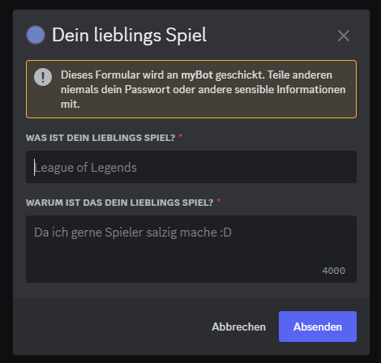

# Step 05 - Making Your First PopupModal

Dies ist eine Schritt-für-Schritt Anleitung um einen eigenen Discord Bot mit C# zu bauen. **Wichtiger Hinweis:** Es werden nur die Grundlagen erklärt um einen funktionierenden Bot zu bauen.

---

### Schritt 01
In diesem Kapitel erstellen wir ein Modal welches interagier bar ist und auf deine Eingaben antwortet.

Zuerst bauen wir unseren ``SlashCommand`` welcher bei der Antwort ein **Modal** erstellt.

Im ``Program.cs`` initialisiern wir allers erst den Command:

```C#
public class Program
{
    private static async Task InitCommands()
    {
        var popupModalCommand = new SlashCommandBuilder()
            .WithName("modal")
            .WithDescription("Creating a simple Modal");

        try
        {

        await _client.CreateGlobalApplicationCommandAsync(popupModalCommand.Build());

        }
        catch (ApplicationCommandException exception)
        {
            var json = JsonConvert.SerializeObject(exception.Errors, Formatting.Indented);

            Console.WriteLine(json);
        }
    }
}
```

Nun haben wir ein **Command** welcher noch nichts macht. Jetzt bauen wir für den Command einen **Respond** welches ein **Modal** ausgibt.

Erweitere nun dein ``CommandController.cs`` um ein Modal zu erstellen:

```C#
public class SlashCommandContoller
{
    public static async Task SlashCommandHandler(SocketSlashCommand command)
    {
        switch (command.Data.Name)
        {
            case "modal":
                await modalCommandHandler(command);
                break;
        }
    }

    private static async Task modalCommandHandler(SocketSlashCommand command)
    {
        var mb = new ModalBuilder()
            .WithTitle("Dein lieblings Spiel")
            .WithCustomId("custom-id")
            .AddTextInput("Was ist dein lieblings Spiel?", "game_name", placeholder: "League of Legends")
            .AddTextInput("Warum ist das dein lieblings Spiel?", "game_reason", TextInputStyle.Paragraph, "Da ich gerne Spieler salzig mache :D");

        await command.RespondWithModalAsync(mb.Build());
    }
}
``` 

TADA!!! Wir haben nun ein Modal erstellt. Dieses Modal können wir befüllen und abschicken, jedoch beim abschicken kriegen wir keine Antwort, nicht einmal ein Fehlercode!



Unser Modal soll nun unsere Eingabe auslesen und einen Text antworten.

Dafür bauen wir nun einen ``ModalHandler`` in einer neuen Klasse ``ModalController``. Um wie beim ``SlashCommand`` deinen Request zu verarbeiten benutzen wir ja den ``SocketSlashCommand`` jedoch arbeiten wir mit einem Modal und Discord.NET hat für Modals ``SocketModal``. 

```C#
public class ModalController
{
    public static async Task ModalHandler(SocketModal modal)
    {
        switch (modal.Data.CustomId)
        {
            case "custom-id":
                await modalResponse(modal);
                break;
        }
    }

    private static async Task modalResponse(SocketModal modal)
    {
        // Abrufen der Werte vom Modal.
        List<SocketMessageComponentData> components = modal.Data.Components.ToList();

        string food = components
            .First(x => x.CustomId == "game_name").Value;

        string reason = components
            .First(x => x.CustomId == "game_reason").Value;

        // Erstellen Sie die zu sendende Nachricht.
        string message = "Hey @everyone; I just learned " + $"{modal.User.Mention}'s favorite Game is " + $"{food} because {reason}.";

        // Geben Sie die AllowedMentions an, damit wir nicht wirklich jeden anpingen.
        AllowedMentions mentions = new AllowedMentions();
        mentions.AllowedTypes = AllowedMentionTypes.Users;

        await modal.RespondAsync(message, allowedMentions: mentions);
    }
}
```